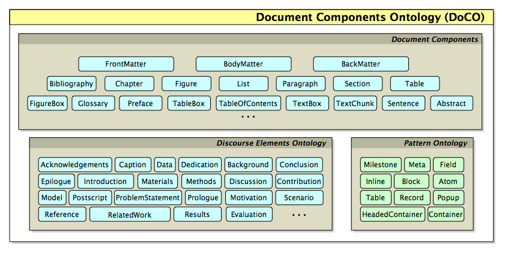

## Description

The _Document Components Ontology_ (**DoCO**) is an OWL 2 DL ontology that provides a general-purpose structured vocabulary of document elements. 
DoCO has been designed as a general unifying ontological framework for describing different aspects related to the content of scientific and other scholarly texts. 
Its primary goal has been to improve the interoperability and shareability of academic documents (and related services) when multiple formats are actually used for their storage.

The creation of DoCO was undertaken by studying different corpora of documents (mainly scientific literature and web documents on different topics) and publishers' guidelines, from two perspectives – the structural and the rhetorical. 
In addition, some informal interviews have been done with researchers in different fields and with academic publishers, in order to gather as much information as possible about document components and their use.

DoCO imports the [Pattern Ontology](http://www.essepuntato.it/2008/12/pattern) that describes structural patterns (introduced in the paper entitled [_Dealing with structural patterns of XML documents_](http://doi.org/10.1002/asi.23088)), and the [_Discourse Element Ontology_](https://www.sparontologies.net/ontologies/deo) (DEO), which was developed with DoCO and describes rhetorical components. 
Additionally, it also defines hybrid classes describing elements that are both structural and rhetorical in nature, such as _paragraph_ (`doco:Paragraph`), _section_ (`doco:Section`) or _list_ (`doco:List`). DoCO is also aligned with the [SALT Rhetorical Ontology](http://lov.okfn.org/dataset/lov/vocabs/sro) and the [Ontology of Rhetorical Blocks](http://www.w3.org/2001/sw/hcls/notes/orb/) (ORB).
A concise summary of the main DoCO classes and its imported ontologies is shown in the following figure.

## Examples of use

In the following subsections, we introduce some examples to showcase how to use DoCO. 

The prefixes that are used in all the examples provided below are defined as follows:

    @prefix : <http://www.sparontologies.net/example/> .
    @prefix doco: <http://purl.org/spar/doco/> .
    @prefix deo: <http://purl.org/spar/deo/> .
    @prefix po: <http://www.essepuntato.it/2008/12/pattern#> .
    @prefix dcterms: <http://purl.org/dc/terms/> .
    @prefix fabio: <http://purl.org/spar/fabio/> .
    @prefix co: <http://purl.org/co/> .
    @prefix c4o: <http://purl.org/spar/c4o> .

### Describing the structure of an article 

DoCO can be used for describing several parts of a document such as a journal article (defined through the [FaBiO](https://www.sparontologies.net/ontologies/fabio) class `fabio:JournalArticle`) connecting then by means of the object property `po:contains`. 
It can be also used in combination with [C4O](https://www.sparontologies.net/ontologies/c4o) and the [Collections Ontology](http://purl.org/co) (CO) for describing its textual content and the particular order in which the various components appear. 
In particular, the actual textual content of each component can be specified through the property `c4o:hasContent`, while the order can be described by using the entities related with the class `co:List`.

    :paper a fabio:JournalArticle ;
        po:contains
            :front-matter ,
            :body-matter ,
            :back-matter ;
        co:firstItem [
            co:itemContent :front-matter ;
            co:nextItem [
                co:itemContent :body-matter ;
                co:nextItem [
                    co:itemContent :back-matter ] ] ] .

    :body-matter a doco:BodyMatter ;
        po:contains
            :section-introduction ,
            :section-related-work ,
            :section-document-components ,
            :section-adoption ,
            :section-conclusions ;
        co:firstItem [
            co:itemContent :section-introduction ;
            co:nextItem [
                co:itemContent :section-related-work ;
                co:nextItem [
                    co:itemContent :section-document-components ;
                    co:nextItem [
                        co:itemContent :section-adoption ;
                        co:nextItem [
                            co:itemContent :section-conclusions ] ] ] ] ] .

    :section-introduction a doco:Section , deo:Introduction ;
        po:containsAsHeader :section-introduction-title ;
        po:contains
            :paragraph-1 ,
            :paragraph-2 ,
            :paragraph-3 ,
            :paragraph-4 ;
        co:firstItem [
            co:itemContent :section-introduction-title ;
            co:nextItem [
                co:itemContent :paragraph-1 ;
                co:nextItem [
                    co:itemContent :paragraph-2 ;
                    co:nextItem [
                        co:itemContent :paragraph-3 ;
                        co:nextItem [
                            co:itemContent :paragraph-4 ] ] ] ] ] .

    :section-introduction-title a doco:SectionTitle ;
        c4o:hasContent 'Introduction' .

    :paragraph-1 a doco:Paragraph ;
        po:contains
            :sentence-1 ,
            :sentence-2 ,
            :sentence-3 ,
            :sentence-4 ,
            :sentence-5 ,
            :sentence-6 ,
            :sentence-7 ;
        co:firstItem [
            co:itemContent :sentence-1 ;
            co:nextItem [
                co:itemContent :sentence-2 ;
                co:nextItem [
                    co:itemContent :sentence-3 ;
                    co:nextItem [
                        co:itemContent :sentence-4 ;
                        co:nextItem [
                            co:itemContent :sentence-5 ;
                            co:nextItem [
                                co:itemContent :sentence-6 ] ] ] ] ] ] .

    :sentence-1 a doco:Sentence ;
        c4o:hasContent 'One of the most important criteria for the
            evaluation of a scientific contribution is the coherent
            organisation of the textual narrative that describes it,
            most often published as a scientific article or book.' .

### Sentences containing references to bibliographic items

Among the various parts of a paper, describing references to other objects of the paper, such as bibliographic references, can be of some interest for keeping track, for instance, the number of times a particular publication is actually cited within a paper. 
DoCO allows one to describe all these parts and to link them together.

    :sentence a doco:Sentence ;
        c4o:hasContent 'For instance, a recent report by Beck [3]
            explains the requirements for an XML vocabulary of
            scientific journals to be acceptable for inclusion
            in PubMed Central.' ;
        po:contains :reference-to-3 .

    :reference-to-3 a deo:Reference ;
        c4o:hasContent '[3]' ;
        dcterms:references :bibliographic-reference-3 .

    :bibliographic-reference-3 a deo:BibliographicReference ;
        c4o:hasContent '[3]	Beck, J. (2010). Report from the Field:
            PubMed Central, an XML-based Archive of Life Sciences
            Journal Articles. In Proceedings of the International
            Symposium on XML for the Long Haul: Issues in the Long-term
            Preservation of XML.
            OA at http://dx.doi.org/10.4242/BalisageVol6.Beck01.' .

## Competency Questions

DoCO can be used for answering several questions related to documents and their structural and rethorical elements.

In the following subsections, some of them are introduced together with their respective SPARQL queries. 

The prefixes that are used in all the SPARQL queries provided below are defined as follows:

    PREFIX : <http://www.sparontologies.net/example/> 
    PREFIX doco: <http://purl.org/spar/doco/>
    PREFIX deo: <http://purl.org/spar/deo/>
    PREFIX po: <http://www.essepuntato.it/2008/12/pattern#>
    PREFIX dcterms: <http://purl.org/dc/terms/>
    PREFIX fabio: <http://purl.org/spar/fabio/>
    PREFIX co: <http://purl.org/co/>
    PREFIX c4o: <http://purl.org/spar/c4o>

### CQ1

What are all the sections contained within the article's body matter, and in which sequential order do they appear?

    SELECT ?section ?sectionType
    WHERE {
        ?bodyMatter a doco:BodyMatter ;
                    co:firstItem ?item .
        
        ?item co:itemContent ?section .
        ?item co:nextItem* ?next .
        ?next co:itemContent ?section .
        
        OPTIONAL { ?section a ?sectionType . }
    }

### CQ2

What is the literal textual content of the first sentence belonging to the first paragraph of the introduction section?

    SELECT ?sentenceText
    WHERE {
        ?introSection a deo:Introduction .
        
        ?introSection co:firstItem ?headerItem .
        ?headerItem co:nextItem ?firstParagraphItem .
        ?firstParagraphItem co:itemContent ?firstParagraph .
        ?firstParagraph a doco:Paragraph .
        
        ?firstParagraph co:firstItem ?firstSentenceItem .
        ?firstSentenceItem co:itemContent ?firstSentence .
        
        ?firstSentence c4o:hasContent ?sentenceText .
    }

### CQ3

Which in-text references are contained within a specific sentence, and what are their literal textual markers?

    SELECT ?reference ?textMarker
    WHERE {
        ?sentence a doco:Sentence ;
                po:contains ?reference .
        
        ?reference c4o:hasContent ?textMarker .
    }

### CQ4

What is the full bibliographic text of the reference cited by a specific inline citation marker?

    SELECT ?inlineMarker ?fullBibliographicText
    WHERE {
        ?reference a deo:Reference ;
                c4o:hasContent ?inlineMarker ;
                dcterms:references ?bibReference .
        
        ?bibReference a deo:BibliographicReference ;
                    c4o:hasContent ?fullBibliographicText .
    }